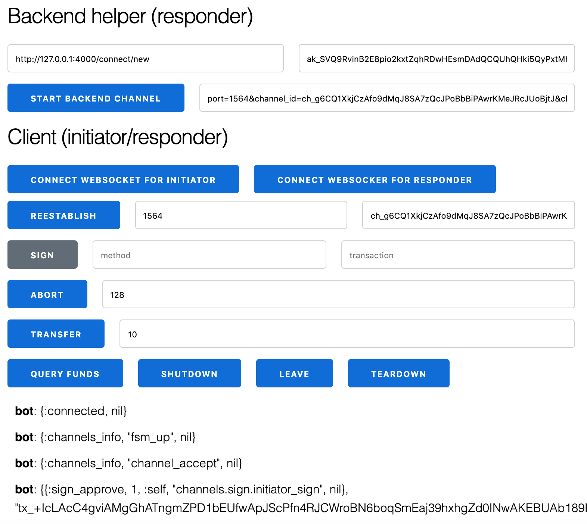

# ae-channel-Interface

This is provided as a interactive helper which visualizes the messages on the state channel.

Screenshot:
<kbd>
  
</kbd>

### Suggested approach (manual initiator, **automatic** backend)
In this example an `automatic backend` is spun up.

The backend logic operates according to rules specifed in the backed session which is located [here](/apps/ae_backend_service/lib/backend_session.ex)

- start the project as described in the main (root) readme
- Point your browser to [http://localhost:4000/](http://localhost:4000/)
- Click 'start backend channel' 
> the backend now spawns the _responder_. The responder now waits for the initiator to connect
> effecitvely a `get` request is shot at the backend in the url form of http://127.0.0.1:4000/connect/new?client_account=ak_SVQ9RvinB2E8pio2kxtZqhRDwHEsmDAdQCQUhQHki5QyPxtMh&port=1610. The response is going to contain the assumed channel parameters for your convenience.
- Click `connect websocket for initiator` 
> you have specified that your browser window represents the _initiator_
- Click `connect`
> messages should start arriving, you will shortly recieve a sign request 
- Click `sign`
> as you might have noticed the `method` and data `to_sign` have been automatically populated. 
> the same goes for `channel_id` which identifies the channel. `channel_id` must be provided to reestablish a lost connection. 
> you need to wait for minimum confirmation time. Have patience (minutes), eventually you should see an `open` message
 

### Suggested approach 2 (manual initiator, manual backend)
In this example you control both the initator and the responder

- start the project as described in the main (root) readme
- Point your browser to [http://localhost:4000/](http://localhost:4000/)
- Click `connect websocket for initiator` 
> you have specified that your browser window represents the _initiator_
- Point _another_ browser to [http://localhost:4000/](http://localhost:4000/)
- Click `connect websocket for responder`
> you have specified that your browser window represents the _responder_
- On both browsers, click `connect`
> messages should start arriving, you will shortly recieve a sign request 
> sign in both ends

> you need to wait for minimum confirmation time. Have patience (minutes), eventually you should see an `open` message